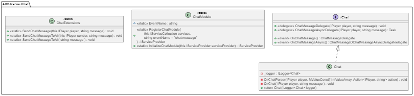

# Chat Module

The chat module offers a quick and easy implementation to handle chat messages in your alt:V server.

## Requirements

This module requires you to have some kind of dependency injection set up in your project that uses the [Microsoft's Dependency Injection](https://learn.microsoft.com/en-us/dotnet/core/extensions/dependency-injection).

Not sure how to implement that? We've got you covered! Our [boilerplate](https://github.com/altv-atlas/Boilerplate) has everything you need to get started.
***
## Getting started

Start by installing the latest version from Nuget.

[](https://www.nuget.org/packages/AltV.Atlas.Chat/)


### Initialization
A quick and simple example:
```cs
var builder = Host.CreateDefaultBuilder( );

builder.ConfigureServices( (context, services) =>
{
    services.RegisterChatModule( ); // <--- Register the chat module
} );
    
var host = builder.UseConsoleLifetime( ).Build( );
host.Services.InitializeChatModule( ); // <-- Initialize the chat module

await host.RunAsync();
```

#### Modifications
By default the event for sending/receiving chat messages is set to the default ``chat:message``. However, this can easily be changed by passing your own event name as second parameter to ``RegisterChatModule``.

The command prefix is set to ``/`` by default, but this can be changed as well by passing it as the third parameter to ``RegisterChatModule``.
NOTE: This module does NOT handle commands. The only reason it has the command prefix parameter is so it can properly verify whether the incoming message is a command or a message.

## Example usage
All that is left now is to hook into the chat events.
For reference, the following example is taken directly from our ``AltV.Atlas.Boilerplate`` project.

```cs
[Injectable(InstantiateOnBoot = true)] // Ensure this class is instantiated on startup (part of AltV.Atlas.IoC)
public class OnChatMessageEvent
{
    private readonly IChat _chat; // The chat instance

    public OnChatMessageEvent( IChat chat ) // Inject chat instance through DI
    {
        _chat = chat;
        _chat.OnChatMessage += OnChatMessage;
        _chat.OnChatMessageAsync += OnChatMessageAsync; // for async stuff
    }

    // Triggered whenever any player has sent a message in the chat
    private void OnChatMessage( IPlayer player, string message )
    {
        player.SendChatMessageToAll( message ); // Send the message to everyone in the server (global chat example)
    }

    private Task OnChatMessageAsync(IPlayer player, string message)
    {
        // do async stuff here.
    }
}
```

## Extending the library
*Note: For a better understanding of how our library works behind the scenes, please have a look at our class diagram below.*

Does our ``IChat`` interface not contain all the required properties you need?

*Advanced chat module is a future addition and thus not yet implemented.*

Our advanced chat module contains more features such as but not limited to:
- Unlimited amount of chats (eg chat channels, private chats, group chats, police radio chats, etc), possibilities are endless.
- Colorized messages.
- Ability to extend the existing functionality to your own needs.
- Add custom tags to messages and channels.
- Highlighting areas of a message when eg a group or player is mentioned.

*Not what you were looking for? Our [boilerplate](https://github.com/altv-atlas/Boilerplate) contains a lot of examples that may help you further.*

## Class Diagram
For a better understanding of how our library works behind the scenes, please have a look at our class diagram below and/or check out [the repository](https://github.com/altv-atlas/Chat).


