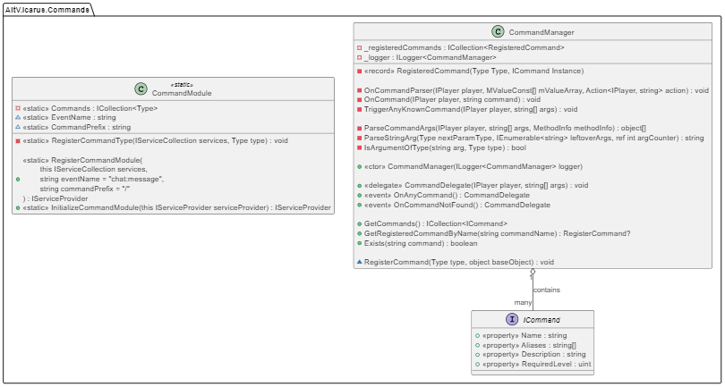

# Command Module

The command module offers a quick and easy implementation to handle commands in your alt:V server.

## Requirements

This module requires you to have some kind of dependency injection set up in your project that uses the [Microsoft's Dependency Injection](https://learn.microsoft.com/en-us/dotnet/core/extensions/dependency-injection).

Not sure how to implement that? We've got you covered! Our [boilerplate](https://github.com/altv-atlas/Boilerplate) has everything you need to get started.
***
## Getting started

Start by installing the latest version from Nuget.

[](https://www.nuget.org/packages/AltV.Atlas.Commands/)


### Initialization
A quick and simple example:
```cs
var builder = Host.CreateDefaultBuilder( );

builder.ConfigureServices( (context, services) =>
{
    services.RegisterCommandModule( ); // <--- Register the command module
} );
    
var host = builder.UseConsoleLifetime( ).Build( );
host.Services.InitializeCommandModule( ); // <-- Initialize the command module

await host.RunAsync();
```

#### Modifications
By default the event for sending/receiving commands is set to the default ``chat:message``. However, this can easily be changed by passing your own event name as second parameter to ``RegisterCommandModule``.

The command prefix is set to ``/`` by default, but this can be changed as well by passing it as the third parameter to ``RegisterCommandModule``.

## Examples

### Creating a new command
Great! You're all set, now let's create your first command.

```cs
// Creating a command is very easy and straight forward.
// Create a new class and make sure it implements the ICommand interface.
public class SpawnVehicleCommand : ICommand
{
    // Required properties
    public string Name { get; set; } = "vehicle";
    public string[ ]? Aliases { get; set; } = new[ ] { "v", "sv" };
    public string Description { get; set; } = "/vehicle [model]";
    public uint RequiredLevel { get; set; } = 0;

    // Always ensure your command has a method named "OnCommand".
    // It's return type can both be "Task" and "void", depending on your needs.
    // An endless amount of parameters can be added, including strings!
    public async Task OnCommand( IPlayer player, uint model )
    { 
        if( player.IsInVehicle )
        {
            player.Vehicle.Destroy( );
        }
        
        var vehicle = await AltAsync.CreateVehicle( model, player.Position, player.Rotation );
        player.SetIntoVehicle( vehicle, 1 );
    }
}
```

#### Limitations
Due to the way our module parses incoming commands from the client-side, you can't put 2 "string" parameters in a row.

Examples:
```cs
// This will NOT work!
public async Task OnCommand( IPlayer player, string arg1, string arg2 )

// This WILL work
public async Task OnCommand( IPlayer player, string arg1, uint arg2, string arg3 )

// This WILL work
public async Task OnCommand( IPlayer player, string arg1, int arg2 )

// This WILL work
public async Task OnCommand( IPlayer player, float arg1, string arg2 )
```

## Extending the library
*Note: For a better understanding of how our library works behind the scenes, please have a look at our class diagram below.*

Does our ``ICommand`` interface not contain all the required properties you need?

No worries! We've got you covered. You can easily extend our interface and then use your own wherever you need.

For example:
```cs
// Extend the interface
public interface IExtendedCommand : ICommand 
{
    string ExtraInfo { get; set; }
}

// Ensure your command implements your own interface
public class SpawnVehicleCommand : IExtendedCommand 
{
    public string Name { get; set; } = "some";
    public string[ ]? Aliases { get; set; } = new[ ] { "v", "sv" };
    public string Description { get; set; } = "/vehicle [model]";
    public uint RequiredLevel { get; set; } = 0;
    public string ExtraInfo { get; set; } = "Spawns the specified vehicle for you.";

    public async Task OnCommand( IPlayer player, uint model )
    { 
        //...
    }
}
```

*Not what you were looking for? Our [boilerplate](https://github.com/altv-atlas/Boilerplate) contains a lot of examples that may help you further.*

## Class Diagram
For a better understanding of how our library works behind the scenes, please have a look at our class diagram below and/or check out [the repository](https://github.com/altv-atlas/Commands).


