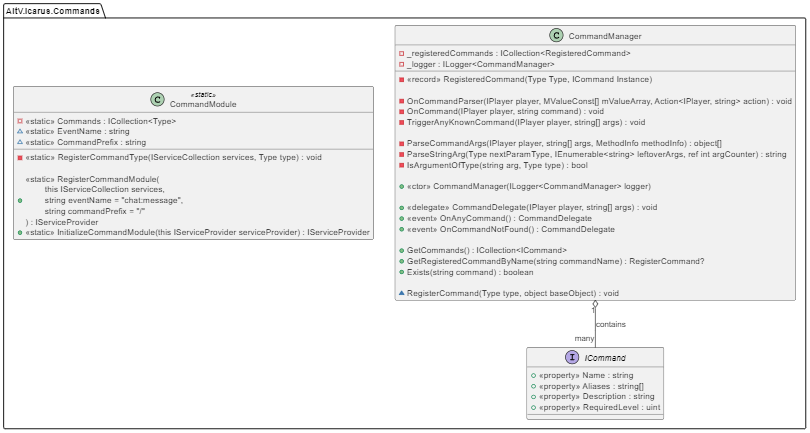

# Ped Module

The ped module offers a quick and easy implementation to enable synced peds in your server.

[!INCLUDE [requirements](~/includes/requirements.md)]
## Getting started

Start by installing the latest version from Nuget.
You will need to install both server-side and client-side packages for the module to work properly.

[](https://www.nuget.org/packages/AltV.Atlas.Peds/)
[](https://www.nuget.org/packages/AltV.Atlas.Peds.Client/)

### Initialization
A quick and simple example:

> [!NOTE]
> These steps have to be done for both client-side and server-side!

```cs
var builder = Host.CreateDefaultBuilder( );

builder.ConfigureServices( (context, services) =>
{
    services.RegisterPedModule( ); // <--- Register the ped module
} );
    
var host = builder.UseConsoleLifetime( ).Build( );

await host.RunAsync();
```

Additionally, make sure you override the altV ped factory with ours:
```cs
public override IEntityFactory<IPed> GetPedFactory( )
{
    return _bootstrapper.Value.Services.GetService<IEntityFactory<IPed>>( ); // Or wherever you've registered it
}
```

## Using the module

Our module uses ``PedTasks`` to specify what a ped should or should not do.

> [!TIP]
> While it is not mandatory, we advise to use a shared module for your client-side and server-side to share ``PedTask`` classes between.
> The example below will assume you have a shared module in place

### Creating a new ped task

### Shared
```cs
using AltV.Atlas.Peds.Shared.Interfaces;
using AltV.Net.Shared.Elements.Entities;

// Creating a ped task is very easy and straight forward.
// Create a new class and make sure it implements the IPedTask interface.
// For example, let's create a ped task that makes the ped attack the target player:
public abstract class PedTaskAttackPlayerBase : IPedTask
{
    public uint TargetId { get; set; } // The target player
    public uint WeaponHash { get; set; } // The weapon the ped should hold (optional)

    public PedTaskAttackPlayerBase( uint targetId, uint weaponHash = 0 )
    {
        TargetId = targetId;
        WeaponHash = weaponHash;
    }

    public virtual void OnStart( ISharedPed ped )
    {
        throw new NotImplementedException( ); // not handled in shared module
    }

    public virtual void OnStop( ISharedPed sharedPed )
    {
        throw new NotImplementedException( ); // not handled in shared module
    }
}
```

### Server-side
On server-side, you generally don't need to do much aside from defining the ped task
```cs
using AltV.Atlas.Boilerplate.Shared.Peds.Tasks;
using AltV.Net.Enums;

public class PedTaskAttackPlayer : PedTaskAttackPlayerBase
{
    public PedTaskAttackPlayer( uint targetId, WeaponModel? weaponModel = null ) : base( targetId, weaponModel is null ? 0 : (uint) weaponModel )
    {
    }

    public override void OnStop( ISharedPed sharedPed )
    {
        // However, you can still override these methods here.
        // OnStop is called when the ped dies, and thus may be useful in certain scenarios
    }
}
```

### Client-side
Now this is where most of the magic happens.
First we create a new class that inherits from the ``PedTaskAttackPlayerBase`` class which we defined in our ``Shared`` module.
The ``OnStart`` method is automatically triggered when the task is assigned on server-side and when the ped enters stream distance.
The ``OnStop`` method is automatically triggered when the ped exits stream distance.
Any properties that were defined before will be available on client-side to be used (eg ``TargetId`` and ``WeaponHash``).
Since this task requires the ped to perform tasks on an interval, we simply add one that runs every 500 milliseconds.
Then in ``On500ms``, it calls natives to run the necessary checks and make the ped perform the task.

```cs
public class PedTaskAttackPlayer : PedTaskAttackPlayerBase
{
    private IAtlasClientPed _ped;
    private IPlayer? _target;
    private uint? _interval;

    public PedTaskAttackPlayer( uint targetId, uint weaponHash ) : base( targetId, weaponHash )
    {
    }
    
    public override void OnStart( ISharedPed ped )
    {
        if( ped is not IAtlasClientPed atlasClientPed || !ped.Exists )
            return;
        
        _target = Alt.GetAllPlayers( ).FirstOrDefault( p => p.RemoteId == TargetId );
        _ped = atlasClientPed;
        
        if( WeaponHash != 0 )
        {
            Alt.Natives.SetCanPedSelectAllWeapons( _ped.ScriptId, true );
            Alt.Natives.GiveWeaponToPed( _ped.ScriptId, WeaponHash, 9999, false, true );
            Alt.Natives.SetCurrentPedWeapon( _ped.ScriptId, WeaponHash, true );
        }

        _interval = Alt.SetInterval( On500ms, 500 );
    }

    private void On500ms( )
    {
        if( _target is null )
            return;
            
        Alt.Natives.ClearPedSecondaryTask( _ped.ScriptId );

        var dist = _ped.Position.Distance( _target.Position );
        var shouldShoot = dist is < 56 and > 48 or < 36 and > 28 or < 26 and > 18 or < 16 and > 8 or < 6;
        var hasLosToTarget = Alt.Natives.HasEntityClearLosToEntity( _ped.ScriptId, _target, 17 );
        var firingPattern = Alt.Hash( "FIRING_PATTERN_FULL_AUTO" );

        if( hasLosToTarget )
        {
            if( WeaponHash != 0 )
            {
                Alt.Natives.TaskShootAtEntity( _ped.ScriptId, _target, 5000, firingPattern );
            }
            else
            {
                Alt.Natives.TaskCombatPed( _ped.ScriptId, _target, 0, 16 );
            }
        }
        else if( dist is < 120 and > 5 )
        {
            Alt.Natives.TaskGoToEntityWhileAimingAtEntity( _ped.ScriptId, _target, _target, 1.7f, true, 0, 0, true, true, firingPattern );
        }
    }

    public override void OnStop( ISharedPed sharedPed )
    {
        Alt.Natives.RemoveAllPedWeapons( _ped.ScriptId, true );
    
        if( _interval is not null )
        {
            Alt.ClearInterval( (uint) _interval );
            _interval = null;
        }
    }
}
```

#### Limitations
- Due to inheritance issues in altV v15, it is not possible to extend our ``AtlasPed``.

*Not what you were looking for? Our [boilerplate](https://github.com/altv-atlas/Boilerplate) contains a lot of examples that may help you further.*

## Class Diagram
For a better understanding of how our library works behind the scenes, please have a look at our class diagram below and/or check out [the repositories on github](https://github.com/altv-atlas).

class diagram TBA
<!--  -->
